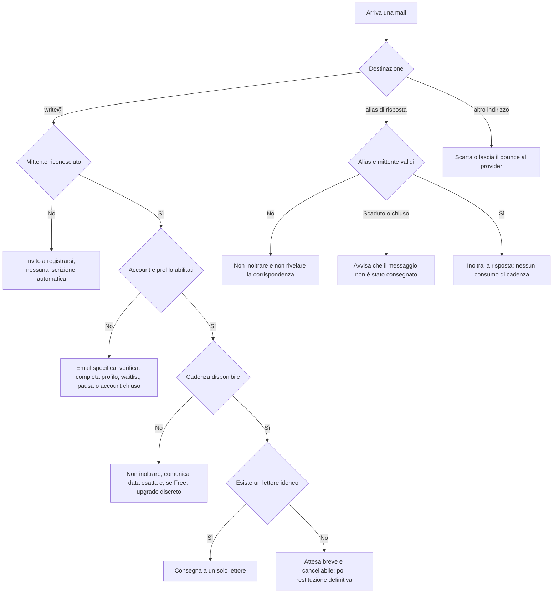

# One Reader — mappa delle email transazionali

**Stato:** catalogo completo; primo nucleo MVP implementato  
**Data:** 14 agosto 2026  
**Ambito:** flussi immaginabili sulla base del prodotto, degli stati account e della pipeline attuali. Gli indirizzi e il provider definitivi saranno configurati vicino al rilascio.

---

## 1. Principi

1. Una mail transazionale nasce sempre da un'azione della persona, da una variazione del suo account o da un evento necessario per consegnare il servizio. Journal, aggiornamenti editoriali e promozioni restano separati.
2. Nessun pixel di apertura, click tracking o contenuto della lettera negli analytics.
3. Ogni evento ha una chiave di idempotenza: lo stesso webhook o lo stesso messaggio non deve produrre due email.
4. Le email normali non mostrano indirizzi reali, identità dell'altro membro, score o informazioni di moderazione.
5. Le azioni sensibili si confermano su una pagina: un `GET` aperto da uno scanner email non modifica mai lo stato.
6. Le date sono assolute e locali quando possibile: «puoi scrivere di nuovo il 12 novembre 2026», non «tra circa tre mesi».
7. Le risposte in una corrispondenza aperta non consumano la cadenza per iniziare nuove lettere.
8. Il silenzio del destinatario non genera solleciti, giudizi o penalizzazioni.
9. Errori temporanei vengono ritentati in silenzio; si scrive all'utente solo quando deve fare qualcosa o quando l'esito è definitivo.
10. Ogni template deve avere versione HTML e testo semplice, oggetto sobrio, preheader non sensibile e un solo invito principale.
11. L'oggetto vive nella casella di posta e non viene ripetuto come titolo nel corpo. L'eventuale titolo interno completa l'oggetto o viene omesso.
12. Tutte le email di servizio condividono un unico layout minimale; solo il testo delle lettere conserva una resa editoriale serif.

### Priorità

- **MVP** — necessaria per una beta reale.
- **Rilascio** — necessaria prima dei pagamenti o dell'apertura pubblica.
- **Dopo** — legata a funzioni non ancora attive.
- **Silenzio** — scelta deliberata: non inviare una mail.
- **Decisione** — comportamento ancora da approvare.

---

## 2. Albero principale di una mail in ingresso

---

## 3. Identità, registrazione e waitlist

| ID | Evento | Destinatario | Esito previsto | Priorità |
|---|---|---|---|---|
| AUTH-01 | Richiesta di registrazione o accesso | Indirizzo inserito | Magic link monouso, scadenza breve, stesso testo generico sia per account nuovo sia esistente per evitare enumerazione | MVP |
| AUTH-02 | Magic link riscattato e account nuovo | Nuovo membro | Conferma account e link per completare mese/anno di nascita, lingue e disponibilità | MVP |
| AUTH-03 | Profilo ancora incompleto dopo la verifica | Membro verificato | Un promemoria operativo; nessuna serie automatica insistente | Decisione |
| AUTH-04 | Magic link scaduto o già usato | Persona che riprova | Nessuna nuova email automatica; la pagina permette di richiederne uno nuovo | Silenzio |
| AUTH-05 | Richiesta cambio email | Vecchio e nuovo indirizzo | Verifica al nuovo indirizzo; avviso di sicurezza al vecchio; conferma dopo il cambio | Rilascio |
| AUTH-06 | Cambio email fallito o link scaduto | Membro | Esito nella pagina; nuova email solo su nuova richiesta | Silenzio |
| AUTH-07 | Età minima non raggiunta | Persona che completa il profilo | Messaggio chiaro: servizio dai 14 anni; nessuna attivazione o conservazione del testo di eventuali lettere | MVP |
| AUTH-08 | Mese/anno corretti tramite richiesta privacy | Membro | Ricezione richiesta e conferma della correzione conclusa | Rilascio |
| WAIT-01 | Iscrizione alla waitlist | Iscritto | Magic link operativo per verificare la casella | MVP |
| WAIT-02 | Verifica waitlist completata | Iscritto | Posto salvato; spiega che non è una selezione e che si verrà contattati quando apre la coorte | MVP |
| WAIT-03 | Email già presente in waitlist | Iscritto | Stesso esito rassicurante; niente duplicati o rivelazioni prima della verifica | MVP |
| WAIT-04 | Posto disponibile / apertura della coorte | Iscritto verificato | Invito ad attivare il profilo e data di inizio della stagione founding | Rilascio |
| WAIT-05 | Invito non usato | Iscritto | Al massimo un promemoria; il posto non viene descritto come “rifiutato” | Decisione |
| WAIT-06 | Uscita volontaria dalla waitlist | Ex iscritto | Conferma della rimozione e stato separato del consenso Journal | MVP |
| WAIT-07 | Waitlist convertita in membro | Membro | Conferma dell'accesso e riepilogo della stagione gratuita | Rilascio |

---

## 4. Nuova lettera inviata a `write@onereader.co`

### 4.1 Mittente non riconosciuto o non pronto

| ID | Caso | Cosa fa il sistema | Email al mittente | Priorità |
|---|---|---|---|---|
| OPEN-01 | Indirizzo non associato a un account | Non crea automaticamente account, waitlist o consenso marketing. Registra solo metadati minimi anti-abuso/deduplica | «Non sei ancora registrato» con link di registrazione | MVP |
| OPEN-02 | Non membro arrivato dal pulsante pubblico “Scrivi” | Come OPEN-01; il `mailto` non equivale a consenso o iscrizione | Stesso template, eventualmente con ritorno alla pagina da cui è partito | MVP |
| OPEN-03 | Account `pending_email` | Non inoltra la lettera | Nuovo link di verifica o link per richiederlo | MVP |
| OPEN-04 | Account `waitlisted` | Non inoltra la lettera | Spiega che la scrittura si aprirà con la coorte; nessun invito all'upgrade prima dell'apertura | MVP |
| OPEN-05 | Profilo senza nascita o lingue complete | Non avvia il matching | Link diretto alla sezione da completare; spiega che la lettera non è partita | MVP |
| OPEN-06 | Membro sotto l'età minima | Non conserva né inoltra il contenuto oltre il tempo tecnico necessario | Esito età minima e indicazione su cancellazione/account | MVP |
| OPEN-07 | Account `delivery_paused` | Non avvia una nuova corrispondenza | Link per verificare la casella e riattivare ricezione/scrittura | MVP |
| OPEN-08 | Account chiuso | Non riapre l'account e non inoltra | Conferma che l'indirizzo non ha un account attivo; percorso supporto/nuova registrazione secondo policy | Rilascio |
| OPEN-09 | Account `checkout_pending` ma Free ancora valido | Deve conservare l'entitlement Free; lo stato checkout non dovrebbe bloccare il servizio | Si applica il normale esito Free; eventuale pagamento resta separato | Decisione |
| OPEN-10 | Mittente automatico, autoresponder o spoof con DKIM/DMARC fallito | Scarta per evitare loop e backscatter | Nessuna risposta | Silenzio |

**Decisione confermata per OPEN-01/02:** non si crea mai un account senza consenso. Si conserva per un periodo breve soltanto il tentativo minimo necessario per deduplica e anti-abuso, non il corpo della lettera. Si invia una sola email di registrazione; dopo l'iscrizione la persona dovrà scrivere una nuova lettera.

### 4.2 Cadenza e membership

| ID | Caso | Cosa accade alla lettera | Contenuto dell'email | Priorità |
|---|---|---|---|---|
| PACE-01 | Free, prima apertura disponibile | Matching normale | Conferma di presa in carico con prossima data disponibile | MVP |
| PACE-02 | Ingresso gratuito, apertura già utilizzata | Non inoltrare | Può continuare conversazioni aperte e ricevere; l'annuale abilita una nuova apertura ogni 24 ore | MVP |
| PACE-03 | Annual, nuova apertura prima delle 24 ore | Non inoltrare | Data/ora esatte; nessuna proposta di upgrade | MVP |
| PACE-04 | Founding season, nuova apertura prima delle 24 ore | Non inoltrare | Data/ora esatte e data fine stagione, senza pressione | MVP |
| PACE-05 | Più tentativi durante la stessa finestra bloccata | Deduplica per `member + next_available_at`; non accumula lettere | Prima risposta immediata, poi al massimo una risposta ogni 24 ore | MVP |
| PACE-06 | Upgrade completato dopo un tentativo Free bloccato | Non spedire automaticamente il testo respinto | Conferma annuale e invito a reinviare quando vuole | Rilascio |
| PACE-07 | Downgrade ad annuale scaduto | Passa alla cadenza Free senza chiudere conversazioni | Comunica la prossima data disponibile calcolata con la regola Free | Rilascio |

**Decisione applicata nell'MVP:** una lettera bloccata dalla cadenza non parte automaticamente settimane o mesi dopo. Viene dichiarata “non inviata” e non ne viene conservato il testo oltre il tempo tecnico necessario. È più prevedibile e riduce la conservazione di testi non consegnati.

### 4.3 Contenuto e instradamento

| ID | Caso | Esito | Email al mittente | Priorità |
|---|---|---|---|---|
| CONTENT-01 | Solo allegato, testo vuoto o quasi vuoto | Non inoltrare | «Qui viaggiano solo le parole» e invito a reinviare il testo nel corpo | MVP |
| CONTENT-02 | Testo valido con allegati | Inoltra solo il testo | Avviso separato che gli allegati sono stati rimossi | MVP, già predisposto |
| CONTENT-03 | Testo oltre il limite | Non troncare silenziosamente | Indica il limite e chiede di reinviare una versione più breve | MVP |
| CONTENT-04 | Firma e cronologia citata rimosse | Inoltra il testo utile | Nessuna email aggiuntiva, salvo testo rimasto vuoto | Silenzio |
| CONTENT-05 | Una sola lingua di scrittura configurata | Usa quella lingua | Nessuna scelta richiesta | MVP |
| CONTENT-06 | Più lingue di scrittura configurate e lingua non determinabile | Non scegliere a caso | Link per scegliere la lingua e confermare l'invio | Decisione |
| CONTENT-07 | Duplicato/replay dello stesso provider message ID | Riconosce l'evento già processato | Nessuna seconda consegna o seconda risposta | Silenzio |
| CONTENT-08 | Contenuto contrario alle regole | Nessun filtro automatico previsto allo stato attuale | La moderazione parte solo da segnalazione del ricevente; nessuna email preventiva | Silenzio |

### 4.4 Matching, attesa e consegna

| ID | Caso | Esito | Email al mittente | Priorità |
|---|---|---|---|---|
| MATCH-01 | Lettore idoneo trovato | Riserva coppia e consegna a una persona | Conferma sobria: lettera affidata/consegnata, senza identità o tracking | MVP |
| MATCH-02 | Nessun lettore idoneo al primo tentativo | Attesa breve, cifrata e cancellabile | Dopo una breve soglia, «stiamo aspettando il lettore giusto» con possibilità di annullare | MVP |
| MATCH-03 | Lettore trovato durante l'attesa | Consegna una sola volta | Conferma della consegna | MVP |
| MATCH-04 | Nessun lettore entro il limite massimo | Chiude la richiesta, cancella il testo secondo retention breve e non consuma la cadenza | Esito definitivo e data in cui può riprovare subito | MVP |
| MATCH-05 | Invio al lettore fallisce temporaneamente | Retry tecnico | Nessuna email durante i retry | Silenzio |
| MATCH-06 | Bounce permanente prima che una persona riceva | Prova un altro lettore idoneo; se impossibile applica MATCH-04 | Scrive solo all'esito definitivo | MVP |
| MATCH-07 | Errore interno definitivo prima della consegna | Non consuma/ripristina la cadenza | Scuse, conferma che la lettera non è partita e invito a riprovare | MVP |
| MATCH-08 | Mittente annulla una lettera in attesa | Rimuove il job e programma cancellazione del contenuto | Conferma annullamento | MVP |

**Regola consigliata:** la cadenza si consuma quando la prima lettera risulta consegnata, non quando arriva a `write@` e non quando il provider restituisce un bounce.

---

## 5. Email ricevuta dal lettore e conversazione

| ID | Evento | Destinatario | Esito email | Priorità |
|---|---|---|---|---|
| CONV-01 | Nuova lettera consegnata | Lettore | La lettera stessa, formattata One Reader, con alias di risposta e link Stop/Report | MVP, in parte implementato |
| CONV-02 | Risposta valida nell'alias attivo | Altro corrispondente | Inoltra la risposta; aggiorna i 30 giorni; non consuma cadenza | MVP |
| CONV-03 | Risposta con allegati | Altro corrispondente + mittente | Solo testo al destinatario; avviso allegati rimossi al mittente | MVP |
| CONV-04 | Risposta da indirizzo diverso da quello autorizzato | Nessuno | Non inoltra e non conferma l'esistenza della coppia; risposta generica solo se non aumenta il rischio di backscatter | Decisione |
| CONV-05 | Alias scaduto dopo 30 giorni | Mittente del tentativo | Il messaggio non è consegnato; spiega che la corrispondenza privata è chiusa | MVP |
| CONV-06 | Corrispondenza interrotta o bloccata | Mittente del tentativo | Messaggio generico: l'altra persona ha scelto di interrompere; nessun motivo o identità | MVP |
| CONV-07 | Corrispondenza segnalata | Mittente del tentativo | Stesso testo generico di CONV-06; non rivela la segnalazione | MVP |
| CONV-08 | Nessuna risposta ricevuta | Mittente originale | Nessun reminder e nessun «la tua lettera è stata ignorata» | Silenzio |
| CONV-09 | Alias vicino alla scadenza | Entrambi | Nessun countdown che crei pressione; si informa solo dopo un tentativo oltre scadenza | Silenzio |
| CONV-10 | Account passa da Annual a Free | Membro | Le conversazioni esistenti continuano senza limiti; nessuna email per ogni risposta | Silenzio |
| CONV-11 | Account viene chiuso/cancellato | Entrambi | Disattiva alias; conferma al titolare; l'altro riceve un esito generico solo se prova a scrivere | Rilascio |

---

## 6. Stop, Report e contatto diretto

| ID | Evento | Destinatario | Esito | Priorità |
|---|---|---|---|---|
| SAFE-01 | Stop confermato | Persona che interrompe | Conferma nella pagina; email opzionale non necessaria | MVP, implementato |
| SAFE-02 | L'altra persona scrive dopo Stop | Mittente del tentativo | Email generica di mancata consegna | MVP |
| SAFE-03 | Report confermato | Segnalante | Conferma nella pagina e, se utile, ricevuta con riferimento privo di contenuto | Decisione |
| SAFE-04 | Nuovo report da revisionare | Moderatore One Reader | Alert interno con priorità/categoria e link alla console; nessun contenuto sensibile nell'oggetto | Rilascio |
| SAFE-05 | Report preso in carico | Segnalante | In genere nessuna email; il report non deve diventare una conversazione automatica | Silenzio |
| SAFE-06 | Revisione conclusa | Segnalante | Solo conferma generica se è utile; mai dettagli sull'account altrui | Decisione |
| SAFE-07 | Violazione confermata | Membro segnalato | Regola violata, misura applicata, durata e percorso di ricorso; decisione umana | Rilascio |
| SAFE-08 | Sospensione o esclusione | Membro interessato | Esito motivato e supporto/ricorso; nessun automatismo basato su score | Rilascio |
| SAFE-09 | Pericolo immediato/autolesionismo | Team interno / eventualmente autore secondo procedura | Flusso dedicato definito con consulenza; non improvvisato nel template generico | Rilascio |
| DIRECT-01 | Prima persona chiede contatto diretto | Richiedente | Conferma richiesta; nessun contatto condiviso | Dopo |
| DIRECT-02 | Richiesta di consenso reciproco | Altra persona | Scelta esplicita sì/no su pagina privata; nessuna pressione | Dopo |
| DIRECT-03 | Entrambi acconsentono | Entrambi | Condivisione controllata dei contatti e chiusura degli alias | Dopo |
| DIRECT-04 | Rifiuto, mancata risposta o scadenza | Richiedente | Nessuna email che trasformi il silenzio in rifiuto pubblico; eventuale semplice scadenza della richiesta | Decisione |

---

## 7. Disponibilità della casella e deliverability

| ID | Evento | Destinatario | Esito | Priorità |
|---|---|---|---|---|
| BOX-01 | Primo bounce morbido | Nessuno | Retry tecnico | Silenzio |
| BOX-02 | Bounce permanente di una mail di servizio | Membro, se esiste un canale alternativo verificato | Stato visibile nell'account; non continuare a scrivere alla casella in bounce | MVP |
| BOX-03 | Tre magic link non riscattati + 30 giorni senza attività | Membro | Ultimo avviso sobrio di pausa, solo se la casella non è in suppression | MVP |
| BOX-04 | Stato `delivery_paused` attivato | Membro | Non riceve nuove assegnazioni; conversazioni e account restano | MVP |
| BOX-05 | Nuovo magic link riscattato | Membro | Conferma riattivazione | MVP |
| BOX-06 | Risposta valida da alias come segnale di attività | Membro | Riattiva in silenzio; la risposta stessa è sufficiente | Silenzio |
| BOX-07 | Cambio email riuscito | Membro | Conferma che le nuove lettere useranno il nuovo indirizzo | Rilascio |
| BOX-08 | Provider mette l'indirizzo in suppression | Team interno | Alert operativo; nessun loop verso l'indirizzo soppresso | Rilascio |

---

## 8. Membership, pagamenti e stagione founding

Questi flussi diventano effettivi solo quando Stripe o un provider equivalente è collegato.

| ID | Evento | Destinatario | Esito | Priorità |
|---|---|---|---|---|
| BILL-01 | Checkout annuale iniziato | Membro | Nessuna email One Reader finché non c'è un cambio di stato; evitare reminder di carrello senza consenso | Silenzio |
| BILL-02 | Pagamento riuscito | Membro | Annual attivo, prezzo/valuta, data rinnovo e cadenza di 24 ore; ricevuta fiscale dal provider | Rilascio |
| BILL-03 | Pagamento fallito in checkout | Membro | Esito nella pagina; email solo se il provider ha creato una sessione recuperabile | Decisione |
| BILL-04 | Upgrade da Free durante finestra bloccata | Membro | Annual attivo; può reinviare subito la lettera non accettata | Rilascio |
| BILL-05 | Rinnovo imminente | Membro | Avviso scritto 30 giorni prima della scadenza con data del rinnovo automatico, importo/valuta, termine per la disdetta e gestione abbonamento | MVP, implementato |
| BILL-06 | Rinnovo riuscito | Membro | Conferma servizio; evitare duplicazione inutile della ricevuta Stripe | Decisione |
| BILL-07 | Primo pagamento di rinnovo fallito | Membro | Aggiorna metodo di pagamento, data prossimo tentativo, nessun effetto sulle conversazioni | Rilascio |
| BILL-08 | Ultimo tentativo fallito | Membro | Data passaggio a Free e prossima apertura disponibile | Rilascio |
| BILL-09 | Cancellazione richiesta | Membro | Conferma che Annual resta attivo fino a data X e poi diventa Free | Rilascio |
| BILL-10 | Cancellazione revocata | Membro | Conferma rinnovo ripristinato | Rilascio |
| BILL-11 | Annual terminato | Membro | Passaggio a Free; ricezione e risposte restano disponibili | Rilascio |
| BILL-12 | Rimborso richiesto | Membro | Presa in carico e tempi attesi | Rilascio |
| BILL-13 | Rimborso approvato/negato | Membro | Esito, importo e conseguenze sul piano | Rilascio |
| FOUND-01 | Inizio stagione founding | Membro waitlist convertito | Data inizio/fine e cadenza 24 ore | Rilascio |
| FOUND-02 | Stagione prossima alla fine | Founding member | Un solo avviso 7 giorni prima con scelta Free/Annual | Rilascio |
| FOUND-03 | Stagione terminata senza acquisto | Membro | Passaggio automatico a Free, nessuna perdita di conversazioni | Rilascio |
| FOUND-04 | Terzo anno founding vicino al rinnovo | Membro idoneo | Comunica in anticipo che il rinnovo del quarto anno userà il prezzo pieno, con importo, valuta e data | Rilascio |
| UA-01 | Concessione Ucraina attivata | Membro idoneo | Conferma 100%, durata e condizioni senza descriverla come selezione | Dopo |
| UA-02 | Riesame annuale per nuove attivazioni | Nuovi richiedenti | Esito solo dopo richiesta; non modifica chi ha già l'agevolazione attiva | Dopo |

---

## 9. Privacy, account e comunicazioni legali

| ID | Evento | Destinatario | Esito | Priorità |
|---|---|---|---|---|
| PRIV-01 | Richiesta accesso ai dati | Membro | Ricevuta con riferimento e tempi | MVP |
| PRIV-02 | Esportazione pronta | Membro | Link monouso a breve scadenza; nessun allegato sensibile | Rilascio |
| PRIV-03 | Richiesta rettifica | Membro | Ricezione e successivo esito | MVP |
| PRIV-04 | Richiesta cancellazione account | Membro | Conferma richiesta tramite magic link o sessione recente | MVP |
| PRIV-05 | Cancellazione completata | Ex membro | Cosa è stato eliminato e cosa resta per obblighi/sicurezza, con tempi | Rilascio |
| PRIV-06 | Journal disattivato | Membro | Conferma nella pagina; email non necessaria | Silenzio |
| PRIV-07 | Modifica sostanziale di Termini/Privacy | Membri interessati | Sintesi, data efficacia e azione richiesta se necessaria | Rilascio |
| PRIV-08 | Incidente di sicurezza notificabile | Persone interessate | Comunicazione dedicata secondo valutazione legale; mai template marketing | Rilascio |

---

## 10. Email operative interne

| ID | Evento | Destinatario interno | Esito | Priorità |
|---|---|---|---|---|
| OPS-01 | Job email definitivamente `dead` | Operazioni | Alert con ID tecnici e link ai log, senza corpo della lettera | MVP |
| OPS-02 | Webhook non verificabile o replay anomalo | Sicurezza/operazioni | Alert aggregato, non una mail per evento | Rilascio |
| OPS-03 | Bounce rate sopra soglia | Operazioni | Alert aggregato per dominio/provider | MVP |
| OPS-04 | Coda senza lettori oltre soglia | Operazioni prodotto | Lingua/bacino/età aggregati, nessuna identità nel subject | MVP |
| OPS-05 | Nuova segnalazione | Moderazione | Vedi SAFE-04 | Rilascio |
| OPS-06 | Segnalazione oltre SLA | Moderazione | Reminder interno/escalation | Rilascio |
| OPS-07 | Segreti, dominio o webhook prossimi a scadenza/errore | Operazioni | Alert tecnico | Rilascio |
| OPS-08 | Job retention/cancellazione fallito | Privacy/operazioni | Alert con riferimento, senza contenuto | Rilascio |

---

## 11. Email che One Reader sceglie di non inviare

- «La persona ha aperto/letto la tua lettera.»
- «Non ti ha ancora risposto» o reminder per sollecitare una risposta.
- Classifiche, streak, conteggi comparativi o punteggi di affidabilità.
- Reminder ripetuti per l'upgrade dopo ogni tentativo.
- Notifica al membro segnalato prima che esista una decisione umana.
- Newsletter o Journal mascherati da comunicazioni di servizio.
- Duplicati della ricevuta fiscale già inviata dal provider, salvo necessità reale.
- Email su retry tecnici che si risolvono senza intervento dell'utente.
- Comunicazioni che rivelano chi ha bloccato o segnalato, o il motivo privato dello Stop.

---

## 12. Decisioni confermate

1. **Mittente sconosciuto:** nessun account senza consenso, nessuna conservazione del corpo della lettera; solo tentativo minimo e una sola email di registrazione.
2. **Annual:** una nuova apertura ogni 24 ore. Le risposte nelle conversazioni aperte restano senza limite.
3. **Founding:** prezzo founding bloccato per i primi tre anni pagati; prezzo pieno dal quarto anno, comunicato prima del rinnovo.
4. **Lettera inviata troppo presto:** rifiuto con data esatta e reinvio esplicito; nessuna coda automatica e nessuna conservazione del testo.

### Decisioni ancora da chiudere prima del test reale

1. **Ingresso gratuito:** una sola apertura iniziale; dopo, ricezione e risposte restano disponibili senza scadenza, mentre l'annuale abilita nuove aperture ogni 24 ore.
2. **Quando si consuma la cadenza:** arrivo, assegnazione o consegna. Raccomandazione: prima consegna riuscita.
3. **Nessun lettore:** durata massima dell'attesa e momento del primo avviso. Raccomandazione: avviso dopo 15 minuti, massimo 7 giorni, annullamento disponibile.
4. **Più lingue:** scelta esplicita nel subject, nel profilo o in una pagina di conferma. Non affidarsi a una selezione casuale.
5. **Ricevuta di consegna:** inviarla sempre o solo in caso di attesa/anomalia. Raccomandazione: una conferma breve alla consegna con la prossima data disponibile.
6. **Report:** sola conferma web o anche ricevuta email con riferimento. Raccomandazione: web per default, email solo se serve un canale di follow-up.

---

## 13. Stato e ordine di implementazione

1. **Implementato:** registro eventi/template con destinatario, payload minimo, idempotency key, retry, esito e anteprima privata.
2. **Implementato:** primi esiti di `write@`: sconosciuto, account/profilo non pronto, età, cadenza, contenuto vuoto o lungo, allegati, nessun lettore e fallimento definitivo.
3. **Implementato:** esito generico degli alias chiusi, scaduti, bloccati o segnalati, senza rivelare la causa.
4. **Parziale:** account e privacy comprendono verifica/profilo/pausa in ingresso e ricevuta della richiesta privacy; esportazione, cancellazione conclusa e riattivazione restano da collegare.
5. Aggiungere billing e founding solo insieme allo stato Stripe deterministico.
6. Aggiungere console moderazione e alert interni prima di aprire Report al pubblico reale.
7. Revisionare copy, lingua e date locali dopo aver chiuso le decisioni residue del §12.
8. **Implementato:** layout email minimale condiviso, template Auth attivi versionati, conferma membership e ricevuta rimborso nella coda comune.
9. **Implementato:** BILL-05 viene pianificata a 30 giorni dalla scadenza, deduplicata per periodo e annullata se il rinnovo non è più attivo; il worker ricontrolla lo stato prima dell'invio.
